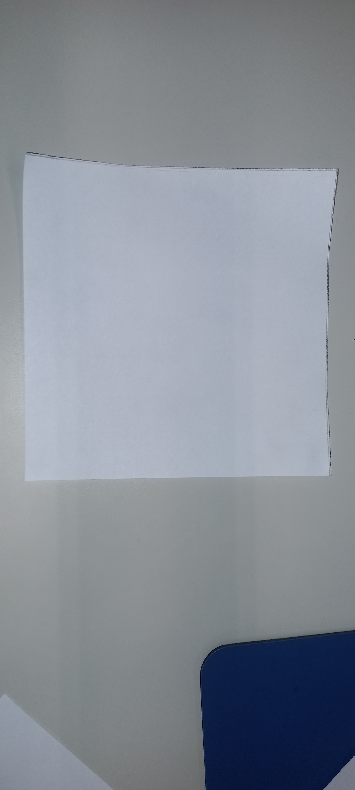
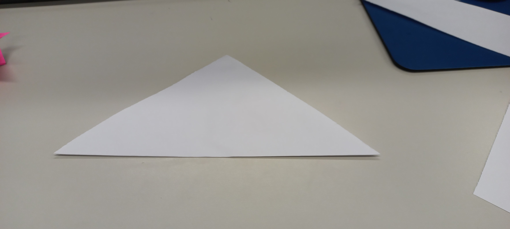
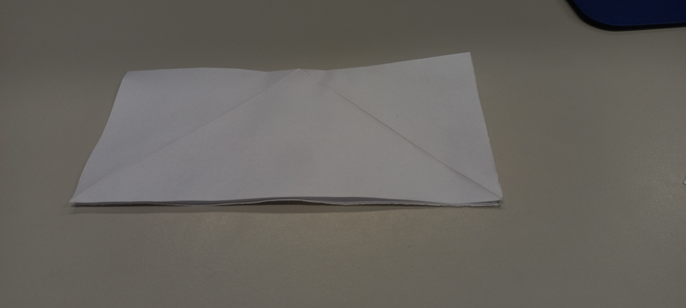
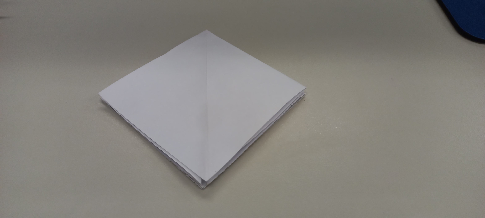
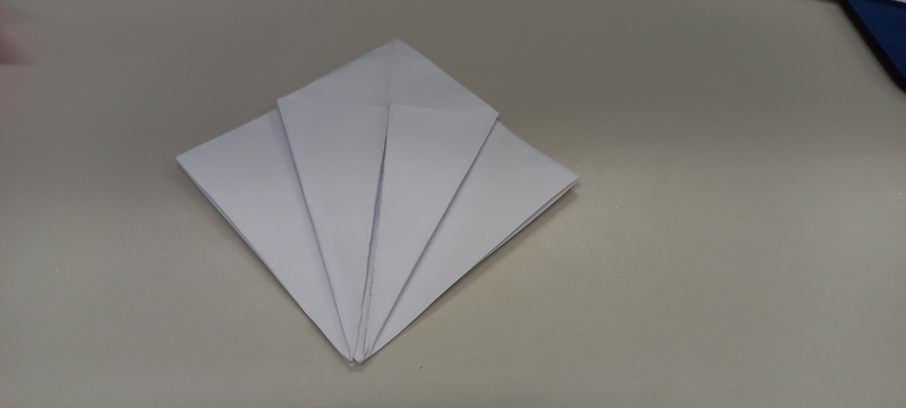
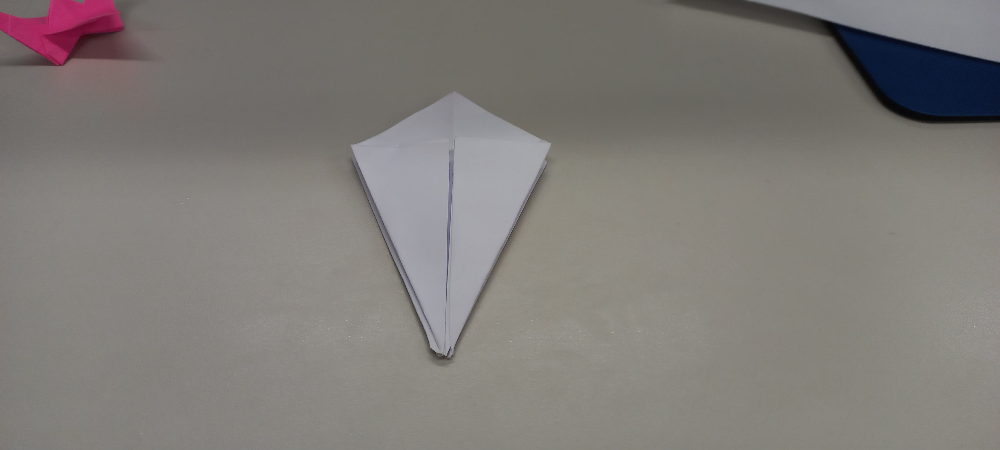
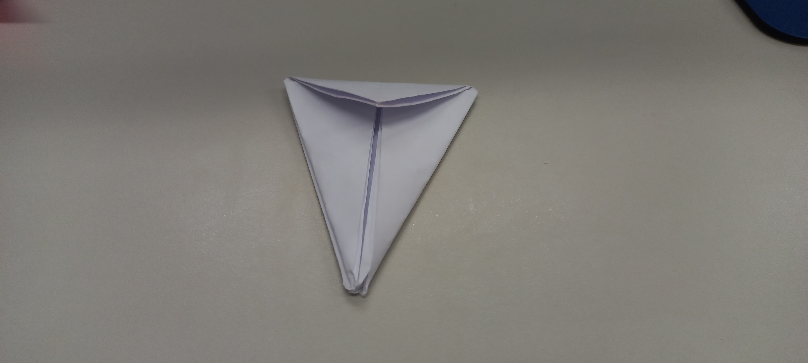
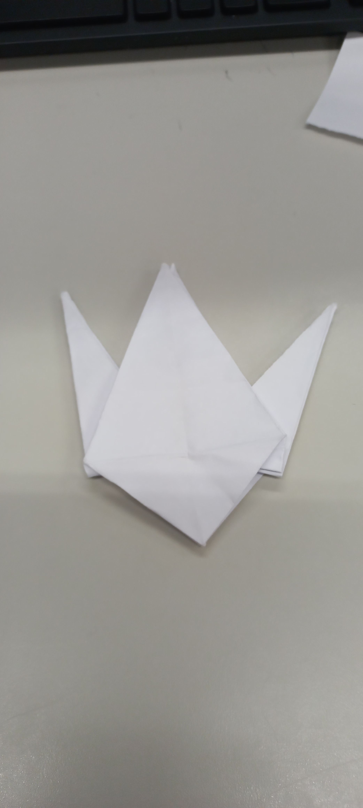
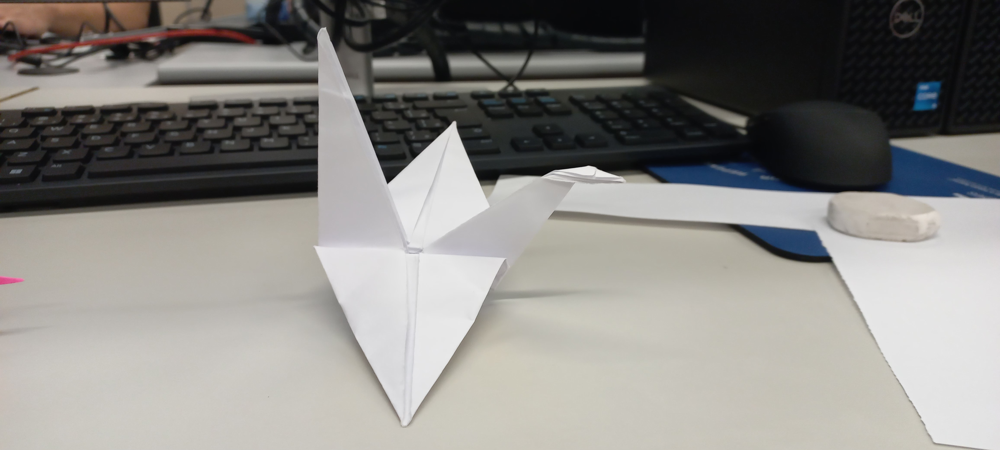

# Tsuru

Passo a passo de como fazer um tsuru 

📄 Você vai precisar de:
1 folha de papel quadrado (preferencialmente 15x15 cm)

Se quiser você pode colorir também

- Passo a passo:
1. Dobre na diagonal
Dobre o papel ao meio na diagonal (formando um triângulo), depois desdobre.

Faça o mesmo na outra diagonal e desdobre. Você terá um "X" no papel.

2. Dobre em cruz
Agora, dobre ao meio na horizontal e desdobre.

Depois dobre na vertical e desdobre. Terá um “+” junto com o “X”.

3. Forme o quadrado base
Vire o papel com a face colorida (ou a que deseja mostrar) para baixo.

Junte os cantos do papel para dentro, formando um quadrado menor (como uma pirâmide achatada). Isso se chama base bomba d’água.

4. Forme o losango
Pegue uma aba do quadrado e dobre os dois lados até o centro, formando um losango (como uma pipa).

Dobre a ponta de cima para baixo (vai parecer um chapéu).

Desdobre tudo e levante a aba de baixo pela pontinha, abrindo como se fosse uma “boca”.

Ajeite nas marcas para formar um losango fino.

Repita esse processo do outro lado.

5. Formar a base do tsuru
Agora você tem um formato com "pernas" embaixo.

Dobre as laterais de cada perna até o centro, como se estivesse afinando.

Depois, levante uma perna pela pontinha, dobrando-a para cima entre as laterais. Isso será o pescoço.

Repita com a outra perna (será a cauda).

6. Asas
Agora, dobre as duas abas superiores para baixo, formando as asas.

Puxe delicadamente a cabeça para frente e dobre a pontinha para baixo.

